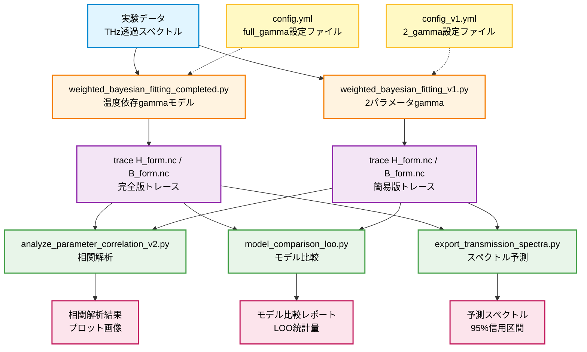
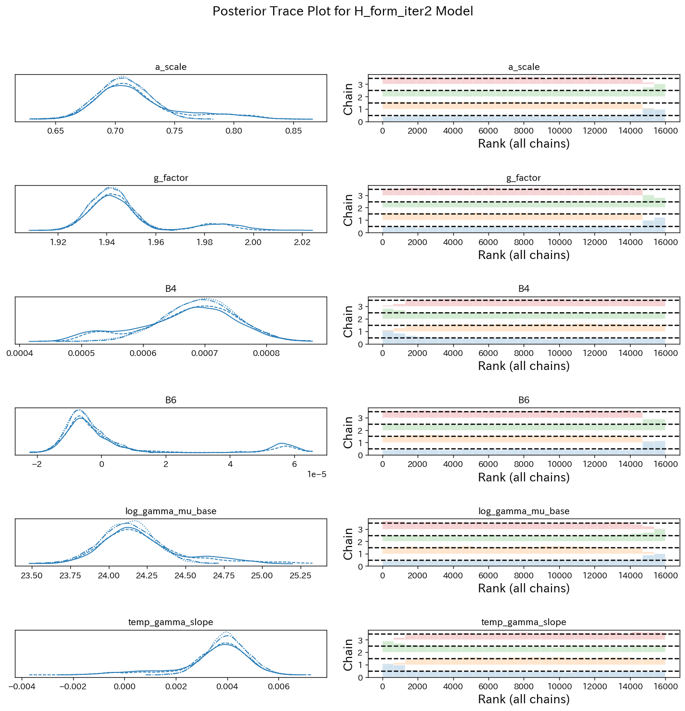
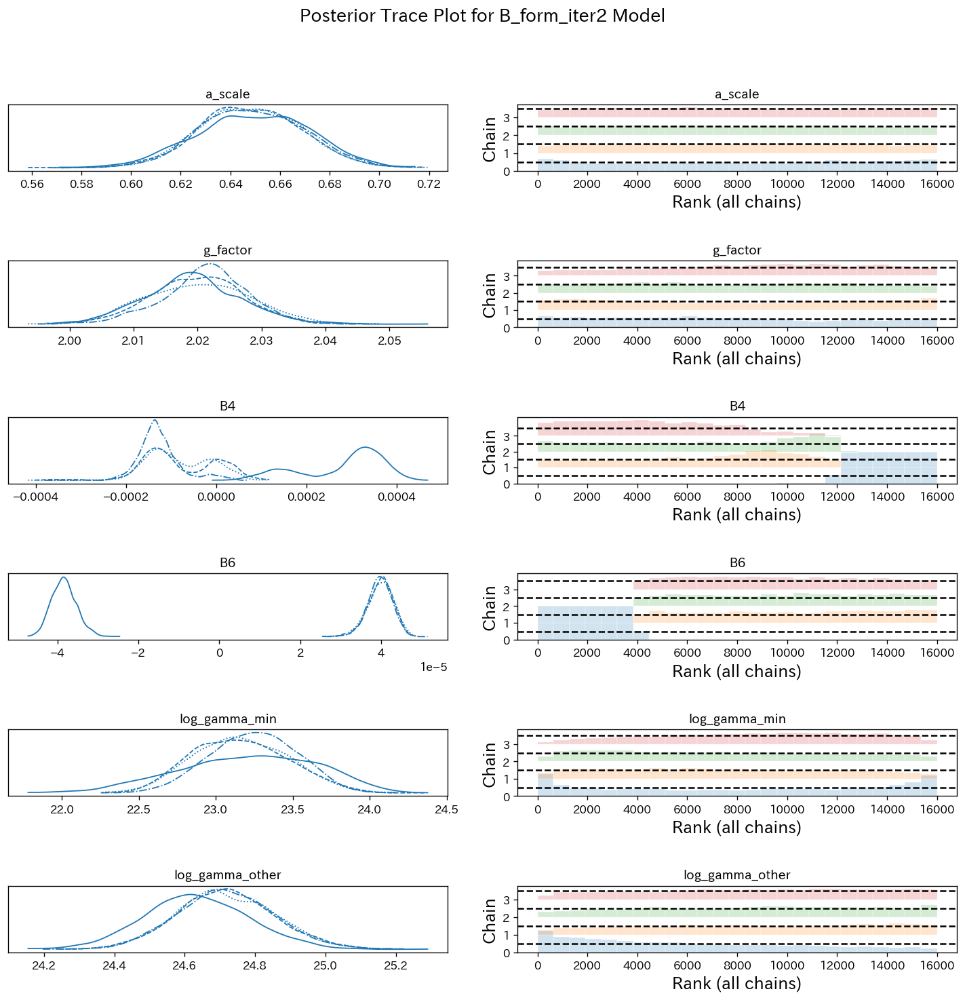
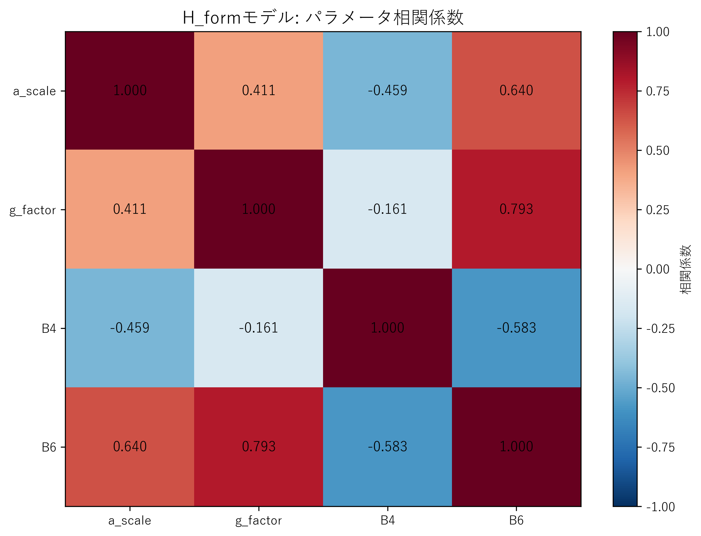
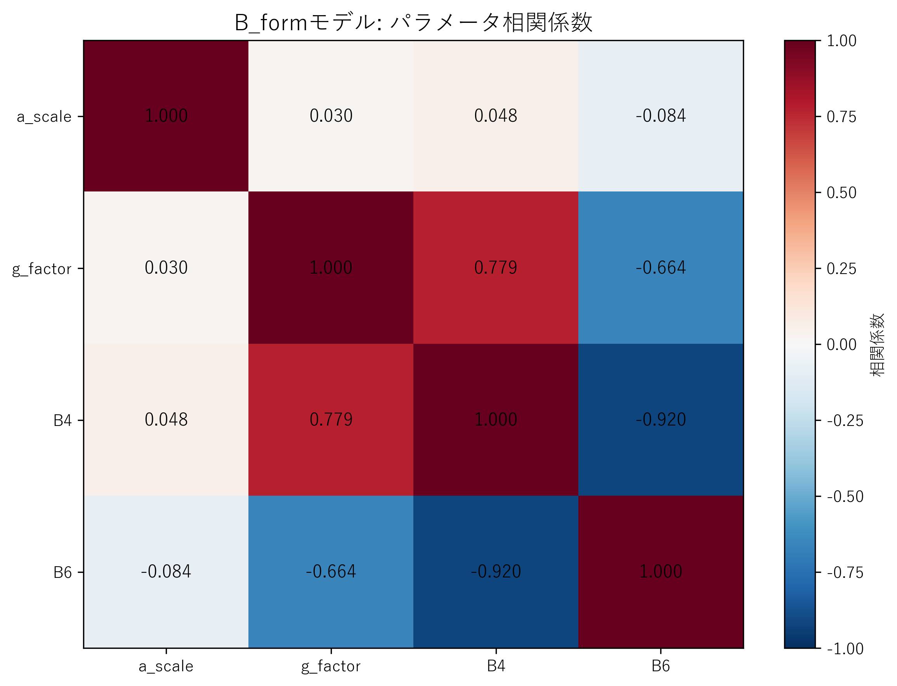
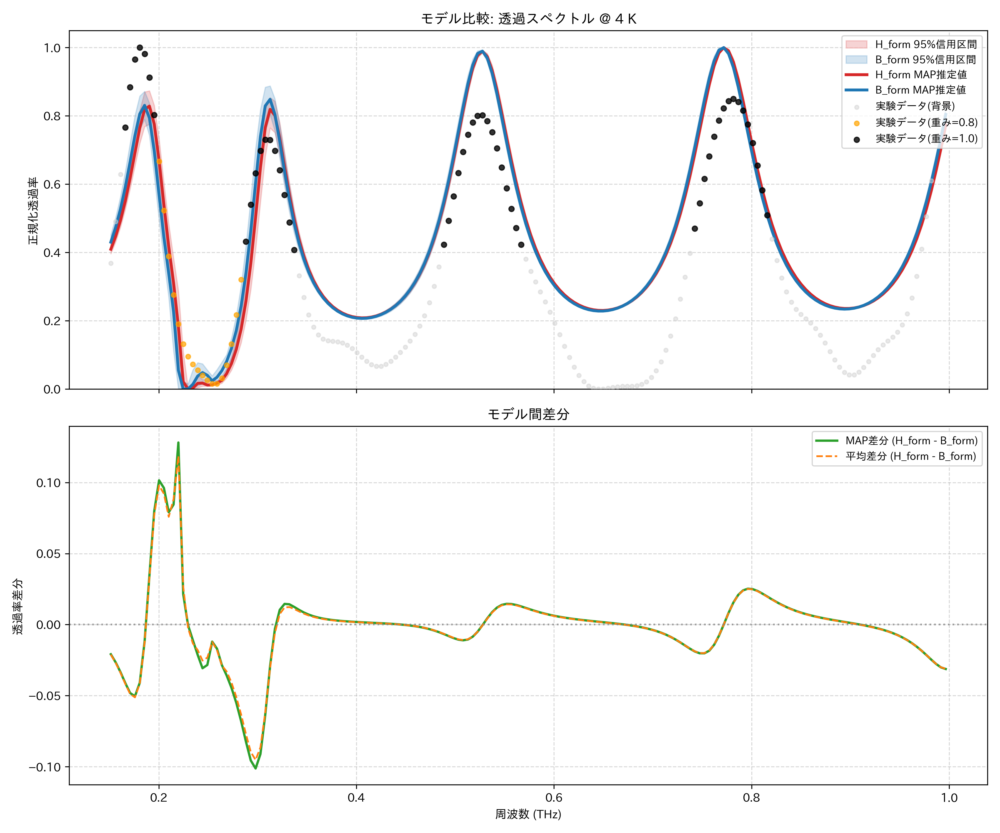
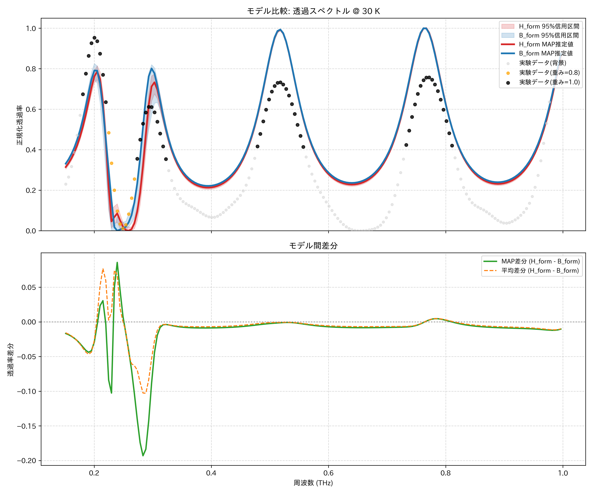
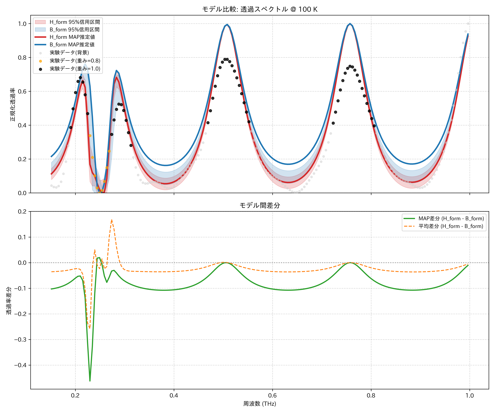
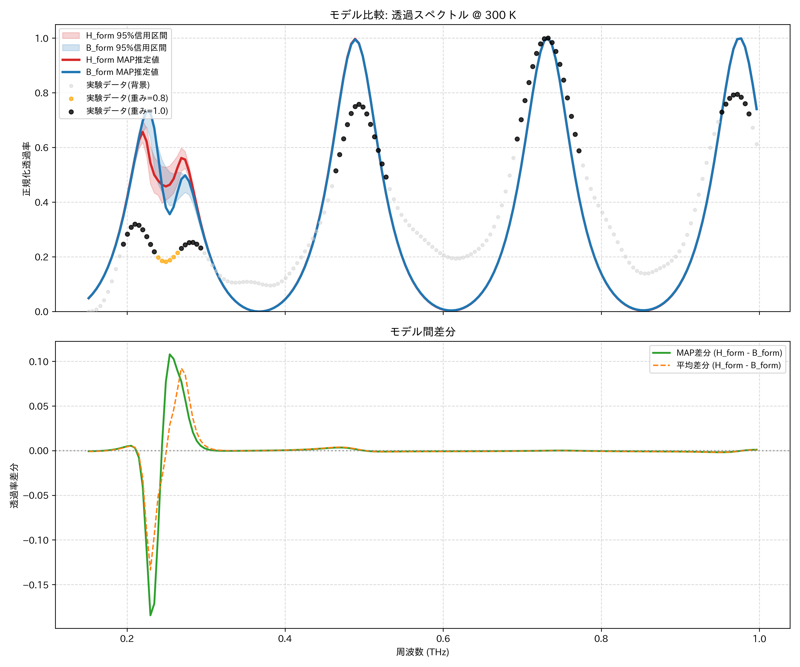

# GGG磁性材料のベイズ推定解析プログラム 報告書

**作成日**: 2025年11月17日  
**対象**: BayesianMTG参加者

---

## 📋 目次

1. [研究の背景と目的](#1-研究の背景と目的)
2. [ベイズ推定の基礎](#2-ベイズ推定の基礎)
3. [解析対象のデータと物理モデル](#3-解析対象のデータと物理モデル)
4. [プログラム構成の全体像](#4-プログラム構成の全体像)
5. [主要プログラムの詳細解説](#5-主要プログラムの詳細解説)
6. [解析結果の解釈](#6-解析結果の解釈)
7. [まとめと今後の展望](#7-まとめと今後の展望)

---

## 1. 研究の背景と目的

### 1.1 研究対象

本研究では, **ガドリニウム・ガリウム・ガーネット（GGG）** という磁性材料の透過スペクトルを解析しています. GGGは磁気光学材料として応用が期待されており, 外部磁場や温度によって透過特性が変化します. 

### 1.2 研究の目的

以下の3つの目的を達成するためにベイズ推定手法を採用しています：

1. **物理パラメータの推定**: 結晶場パラメータ（B4, B6）, g因子, 減衰定数（gamma）など, 材料の物性を特徴づけるパラメータを実験データから推定する
2. **不確実性の定量化**: 測定誤差やモデルの不完全性を考慮し, 推定値の信頼区間を計算する
3. **モデル比較**: 複数の物理モデル（H_formとB_form）のどちらがデータをより良く説明するかを定量的に評価する

---

## 2. ベイズ推定の基礎

### 2.1 ベイズの定理とは

ベイズ推定は, 以下のベイズの定理に基づいてパラメータを推定する手法です：

$$
P(\theta | D) = \frac{P(D | \theta) \cdot P(\theta)}{P(D)}
$$

**用語の説明**:
- $P(\theta | D)$: **事後分布** - データ $D$ を観測した後のパラメータ $\theta$ の確率分布
- $P(D | \theta)$: **尤度** - パラメータ $\theta$ が与えられたときにデータ $D$ が得られる確率
- $P(\theta)$: **事前分布** - データを見る前のパラメータに関する知識
- $P(D)$: **周辺尤度** - 正規化定数（すべてのパラメータで積分した値）

### 2.2 なぜベイズ推定を使うのか？

従来の最小二乗法などと比べて, ベイズ推定には以下の利点があります：

1. **不確実性の表現**: パラメータの点推定だけでなく, その信頼区間を自然に計算できる
2. **事前知識の活用**: 過去の実験や理論的制約を事前分布として組み込める
3. **小サンプルへの対応**: データが少ない場合でも, 事前知識を活用して安定した推定が可能
4. **モデル比較**: 複数のモデルを客観的に比較できる

### 2.3 MCMC（マルコフ連鎖モンテカルロ法）

ベイズ推定では, 事後分布 $P(\theta | D)$ を直接計算することは困難です. そこで, **MCMC** という手法を使って, 事後分布からサンプルを生成します. 

**本研究で使用している手法**:
- **NUTSサンプラー** (No-U-Turn Sampler): 効率的にパラメータ空間を探索する最新のMCMC手法
- **PyMC**: Pythonのベイズ推定ライブラリ
- **NumPyro** (オプション): GPUを活用した高速サンプリング

---

## 3. 解析対象のデータと物理モデル

### 3.1 実験データの構造

現在解析している実験データでは, 以下の条件で透過スペクトルを測定しています：

- **温度**: 4K, 30K, 100K, 300K の4点
- **磁場**: 9K
- **周波数範囲**: 約0.01〜1.0 THz（テラヘルツ帯）
- **測定量**: 透過率 $T(\omega)$

### 3.2 物理モデルの概要

透過スペクトルは以下の物理過程を経て計算されます：

```
[1] 結晶場ハミルトニアンの構築
    ↓
[2] 固有値・固有状態の計算
    ↓
[3] 磁気感受率 $\chi(\omega)$ の計算
    ↓
[4] 比透磁率 $\mu_{r} (\omega)$ の導出
    ↓
[5] 透過率 $T(\omega)$ の計算
```

#### 3.2.1 結晶場ハミルトニアン

GGG中の磁性イオンは, 周囲の結晶場によってエネルギー準位が分裂します. ハミルトニアンは以下の形式：

$$
\hat{H} = g\mu_B B_z \hat{S}_z + (B_4 k_B)(O_4^0 + 5O_4^4) + (B_6 k_B)(O_6^0 - 21O_6^4)
$$

**パラメータの意味**:
- $g$: ランデのg因子（磁気モーメントの大きさ）
- $B_4, $B_6$: 結晶場パラメータ（結晶場の強さ）
- $\hat{O}_4^{0,4}, \hat{O}_6^{0,6}$: Stevens演算子（結晶場の対称性）

#### 3.2.2 磁気感受率の計算

磁気感受率は, 外部磁場に対する磁化の応答を表します：

$$\chi(\omega, T) = G_0 \sum_{i=0}^{6} \frac{\rho_{i+1} - \rho_i}{\omega_{i+1, i} - \omega - i\gamma_{i}} (s + m_i)(s - m_i + 1)$$  

**物理的意味**:
- $\rho_i = \exp(-E_i/k_B T) / Z$: ボルツマン因子（$Z$ は分配関数）.   
- $\omega_{i+1, i} = (E_{i+1} - E_i) / \hbar$: 遷移周波数.   
- $\gamma_i$: 緩和パラメータ（減衰項）.   
- $(s + m_i)(s - m_i + 1)$: $S_z$ 基底での $S_+$ の行列要素（transition_strength）.  
- $G_0 = a_{\text{scale}} \cdot (\mu_0 N_{\text{spin}} (g \mu_B)^2 / 2\hbar)$ は, スケーリング係数 $a_{\text{scale}}$ を含む結合定数です. 

#### 3.2.3 透過率の計算

透過率は, 試料を通過する電磁波の強度比として計算されます：

$$
T(\omega) = \left| \frac{4 \eta \exp(-i\delta)}{(1+\eta)^2 \exp(-i\delta) - (1-\eta)^2 \exp(i\delta)} \right|^2
$$
   * **$\eta = \sqrt{\mu_r / \epsilon_{\text{bg}}}$**: 複素インピーダンス.   
   * $\delta = n \omega d / c = \sqrt{\mu_r \epsilon_{\text{bg}}} (\omega d / c)$: 複素位相.   


### 3.3 推定するパラメータ

本解析では, 以下のパラメータを推定します：

| パラメータ | 記号 | 物理的意味 | 初期値 |
|-----------|------|-----------|--------|
| スケール因子 | $a_{\text{scale}}$ | 磁気感受率の全体的な大きさ | $0.69$ |
| g因子 | $g$ | 磁気モーメントの大きさ | $1.990$ |
| 結晶場パラメータ1 | $B_4$ | 4次の結晶場の強さ | $3.0\times 10^{-4}$ K |
| 結晶場パラメータ2 | $B_6$ | 6次の結晶場の強さ | $3.0 \times 10^{-5}$ K |
| 減衰定数 | $\gamma$ | スペクトル線幅 | $0.11 \text{THz}$ |
| 背景誘電率 | $\epsilon_{\text{bg}}$ | 非磁性成分の誘電率 | **温度依存** |
| 試料厚さ | $d$ | 試料の厚さ | $157.8\mu m$ |

---

## 4. プログラム構成の全体像

本研究では, 以下の5つの主要プログラムで解析を実行しています：



### 4.1 プログラムの役割分担

| プログラム名 | 主な機能 | 出力 |
|-------------|---------|------|
| `weighted_bayesian_fitting_completed.py` | 温度依存gammaモデルのベイズ推定 | トレースデータ（事後分布サンプル） |
| `weighted_bayesian_fitting_v1.py` | 2パラメータgammaモデルのベイズ推定 | トレースデータ（簡略版） |
| `analyze_parameter_correlation_v2.py` | パラメータ間の相関解析 | 相関行列, ヒートマップ |
| `model_comparison_loo.py` | LOO-CVによるモデル比較 | モデル選択指標 |
| `export_transmission_spectra.py` / `_v1.py` | 予測スペクトルの生成 | 95%信用区間付きスペクトル |

---

## 5. 主要プログラムの詳細解説

### 5.1 メイン解析(反復更新アルゴリズム): `weighted_bayesian_fitting_completed.py`, `weighted_bayesian_fitting_v1.py`

#### 5.1.1 課題と解決策: 
**課題** : <br>
磁気パラメータ ($g, B_4, B_6, a_{\text{scale}}, \gamma$) と光学パラメータ ($\epsilon_{\text{bg}}$) は、スペクトル全体に対して相関を持ちます. 特に $\epsilon_{\text{bg}}$ は高周波領域の共振器モード（フリンジ）に強く影響し、磁気パラメータは低周波のピーク（LP/UP）に強く影響します. これらを同時にMCMCで推定すると、パラメータ空間が広大になりすぎ、収束が著しく困難になります.

**解決策（run_analysis_workflow）**:  
config.yml の mcmc.max_iterations に基づき、以下のステップを反復実行します. 

* ステップ 1: $\epsilon_{\text{bg}}(T)$ の推定（高周波領域）  
  磁気応答が小さい高周波領域（\> high_freq_cutoff）のデータのみを使用します.   
  磁気パラメータ群を固定（初回は初期値、2回目以降は前回のベイズ推定結果の平均値）し、`scipy.optimize.curve_fit`（非線形最小二乗法） を用いて、各温度 $T$ の $\epsilon_{\text{bg}}(T)$ のみ最適化します. （`fit_eps_bg_only_temperature()` ）  
* ステップ 2: 磁気パラメータの推定（全周波数領域・重み付き）  
  ステップ1で得られた $\epsilon_{\text{bg}}(T)$ を固定します.   
  全周波数領域のデータと後述の「重み配列」を用いて、PyMCによるベイズ推定（MCMC）を実行します.   
  これにより、温度に依存しない磁気パラメータ ($a_{\text{scale}}, g, B_4, B_6$) と $\gamma$ パラメータの事後分布を得ます. （`run_temperature_bayesian_fit()` 関数）  
* ステップ 3: 反復  
  ステップ2で得られた磁気パラメータ（の平均値）を固定値としてステップ1に戻り、$\epsilon_{\text{bg}}(T)$ を再度更新します. 

この反復により、相関の強いパラメータ群を分離して最適化し、安定した収束を目指します.


#### 5.1.2 アルゴリズムのフローチャート

```
[START]
  ↓
[1] 設定ファイル(config.yml)の読み込み
  ↓
[2] 実験データの読み込みと前処理
  - 周波数範囲の分割（低・中・高周波数領域）
  - 各領域への重み付け設定
  ↓
===
\\ [3]-[5]が反復領域
[3] 温度別の初期パラメータ推定（eps_bg, d）
  - 非線形最小二乗法による予備推定
  ↓
[4] ベイズモデルの構築（PyMC）
  - 事前分布の設定
  - 尤度関数の定義（重み付き）
  ↓
[5] MCMCサンプリングの実行
  - SLICE, Metropolis, NUTSサンプラーによる事後分布のサンプリング
  - 複数チェーンの並列実行
===
  ↓
[6] 収束診断
  - R-hat統計量の確認
  - 有効サンプルサイズ(ESS)の確認
  ↓
[7] 結果の保存
  - トレースデータ（trace_{*model}.nc）
  - パラメータサマリー（CSV）
  - 可視化プロット（PNG）
  ↓
[END]
```

#### 5.1.3 重要な関数の説明

##### (1) `create_frequency_weights()`

**目的**: データの周波数領域ごとに異なる重みを割り当て, 重み付き尤度関数を作成する

**理論的背景**:
- ポラリトン形成領域（低周波数領域）・高次共振器モード（高周波領域）は物理的に重要な情報を含む
- 重み付けにより, 重要な領域を優先的にフィットできる

**アルゴリズム**:<br>
`scipy.signal` ライブラリを用い、実験データの特徴に基づき尤度関数の重みを動的に生成します.
1. **ピーク検出:** `find_peaks` と `peak_widths` を用い、実験データのピーク位置と半値幅（FWHM）を特定します.   
2. **領域分類:** 設定ファイル `config.yml` の `weight_settings` に基づき、各データ点を以下の領域に分類します.   
   * LP/UPピーク領域（FWHM内）: lp_up_peak_weight (1.0)  
   * LP-UPピーク間領域: between_peaks_weight (0.8)  
   * 高周波共振器モード: high_freq_peak_weight (1.0)  
   * その他: background_weight (0.01)  
3. 重み付き尤度: MCMC実行時、この重み $w_i$ を用いて、観測ノイズ $\sigma$ を調整します. 

   $$\sigma_{\text{adjusted}, i} = \sigma / \sqrt{w_i}$$

   尤度関数 $Y_{\text{obs}} \sim \mathcal{N}(\mu_{\text{model}}, \sigma_{\text{adjusted}})$ において、重み $w_i$ が大きい点（ピーク領域など）ほど $\sigma_{\text{adjusted}}$ が小さくなり、モデルとの乖離に対するペナルティ（対数尤度）が大きくなります. これにより、MCMCは物理的に重要な領域を優先的にフィッティングします. 

##### (2) `run_temperature_bayesian_fit()`

**目的**: ベイズ推定のメイン処理

**アルゴリズム**:
```python
def run_temperature_bayesian_fit(datasets, ...):
    """
    1. PyMCモデルの構築
       with pm.Model() as model:
           # 事前分布の設定
           a_scale = pm.Normal('a_scale', mu, sigma)
           g_factor = pm.Normal('g_factor', mu, sigma)
           B4 = pm.Normal('B4', mu, sigma)
           B6 = pm.Normal('B6', mu, sigma)
           log_gamma_mu = pm.Normal('log_gamma_mu', ...)
           ...
           
           # 尤度関数の定義（カスタムOp）
           for each temperature:
               y_pred = TemperatureMagneticModelOp(...)(params) ← 理論計算に基づく予測値
               pm.Normal('obs_T', mu=y_pred(↑理論値), sigma=noise_sigma(設定値), 
                        observed=y_obs(実験データ), weight=weights(重み)) 
    
    2. MCMCサンプリング
       trace = pm.sample(
           draws,        # サンプル数
           tune,         # バーンイン（学習期間）
           chains,          # 並列チェーン数
           nuts_sampler  # サンプラー
       )
    
    3. 収束診断
       summary = az.summary(trace)
       # R-hat < 1.01 を確認（複数チェーン間収束の指標）
       # ESS > 400 を確認（有効サンプル数）
    
    4. 事後分布の保存
       trace.to_netcdf('trace_H,B_form.nc')
    """
```

**重要な概念**:

- **事前分布**: 過去の実験や理論から設定
  - 正規分布 `pm.Normal(mu, sigma)` を使用
  - 例: g因子は2.0付近の値が理論的に妥当
  
- **尤度関数**: データとモデル予測の一致度
  - 重み付き正規分布 `pm.Normal(..., weight=w)` を使用
  - 重みが大きいほど, その領域のフィッティングを重視
  
- **MCMCサンプリング**: 事後分布からのサンプル生成(例を示す)
  - draws=2000: 各チェーンで2000個のサンプルを生成
  - tune=1000: 最初の1000個は学習用（破棄される）
  - chains=4: 独立に4つのチェーンを実行（収束確認のため）



**図1**: 完全版のH形式の事後分布


**図2**: 完全版のB形式の事後分布

#### 5.1.4 2つのモデル（H_form vs B_form）の違い

本研究では, 以下の2つのモデルを比較しています：

| 特徴 | H_form | B_form |
|------|--------|--------|
| 基本方程式 | $\mathbf{B} = \mu_0(\mathbf{H} + \mathbf{M})$ | $\mathbf{H} = \mathbf{B}/\mu_0 - \mathbf{M}$ |
| 感受率の定義 | $\chi_H = \partial M / \partial H$ | $\chi_B = \partial M / \partial B$ |
| 比透磁率 | $\mu_r = 1 + \chi_H$ | $\mu_r = 1/(1 - \chi_B)$ |
| 物理的解釈 | 外部磁場を独立変数とする | 磁束密度を独立変数とする |

**どちらが正しいか？**
- 理論的には両者は等価ですが, 測定条件によって適切なモデルが異なる
- LOO-CV（後述）によって, どちらがデータをより良く説明するかを判定

### 5.2 簡易版: `weighted_bayesian_fitting_v1.py`

#### 5.2.1 完全版との違い

| 項目 | 完全版 (completed.py) | 簡易版 (v1.py) |
|------|----------------------|----------------|
| gammaモデル | 温度依存（7要素×温度） | 2パラメータ（温度非依存） |
| パラメータ数 | 約15個 | 約8個 |
| 計算時間 | 長い（数時間） | 短い（数十分） |
| 物理的妥当性 | 高い | 簡略化 |

#### 5.2.2 2パラメータgammaモデルの詳細

**モデルの仮定**:
```python
# 7つの遷移の減衰定数を2つのパラメータで表現
gamma_array = [gamma_min, gamma_other, gamma_other, ..., gamma_other]
              # ↑最低次遷移  ↑その他6つの遷移
```

**物理的仮定**:
- 最低次エネルギー準位間の遷移（基底状態→第一励起状態）は他の遷移と異なる減衰を持つ可能性
- 高次遷移は同じ減衰定数で近似できる

**利点**:
- パラメータ数の削減 → 収束が速い, 過学習のリスク低下
- 温度依存性を無視 → さらなる簡略化

**欠点**:
- 物理的な詳細を犠牲にしている
- 温度変化が大きい場合は不正確になる可能性


**図3**: 簡易版のH形式の事後分布



**図4**: 簡易版のB形式の事後分布

### 5.3 相関解析: `analyze_parameter_correlation_v2.py`

#### 5.3.1 プログラムの目的

推定されたパラメータ間の相関を可視化し, 以下を確認します：

1. **識別可能性**: パラメータが独立に推定できているか
2. **多重共線性**: 強い相関があるパラメータペアの検出
3. **サンプリング品質**: MCMC収束の妥当性

#### 5.3.2 主要な出力

##### (1) ペアプロット（相関マトリクス）



**図5**: H_formモデルにおけるパラメータ間の相関係数ヒートマップ



**図6**: B_formモデルにおけるパラメータ間の相関係数ヒートマップ

##### (2) 自己相関プロット

MCMCサンプルの系列相関を確認：


**図7**: H_formモデルにおける各パラメータの自己相関プロット


**図8**: B_formモデルにおける各パラメータの自己相関プロット

**理想的な結果**:
- ラグ10以内に相関がゼロに近づく → 独立なサンプルが生成されている
- 長く相関が残る → サンプリング効率が悪い（tuneの調整が必要）

### 5.4 モデル比較: `model_comparison_loo.py`

#### 5.4.1 LOO-CV（Leave-One-Out Cross-Validation）とは

**基本的な考え方**:
1. データを1点ずつ除外
2. 残りのデータでモデルを学習
3. 除外した点の予測精度を評価
4. すべての点で繰り返し, 平均精度を計算

**ベイズ版LOO-CV**:
- 実際には全データで学習した事後分布から, LOO予測分布を近似的に計算
- PSIS-LOO（Pareto Smoothed Importance Sampling）を使用

#### 5.4.2 評価指標

##### (1) ELPD (Expected Log Pointwise Predictive Density)

$$
\text{ELPD}_{\text{loo}} = \sum_{i=1}^{n} \log p(y_i | y_{-i})
$$

**意味**:
- 各データ点の予測対数尤度の合計
- **高いほど良い** モデル

##### (2) LOO-IC (LOO Information Criterion)

$$
\text{LOO-IC} = -2 \times \text{ELPD}_{\text{loo}}
$$

**意味**:
- AICやBICと同様の情報量規準
- **低いほど良い** モデル

##### (3) p_loo (Effective Number of Parameters)

$$
p_{\text{loo}} = \text{ELPD}_{\text{loo}} - \sum_{i=1}^{n} \log p(y_i | y)
$$

**意味**:
- モデルの実効的なパラメータ数
- 過学習の指標（大きすぎると過学習の可能性）

##### (4) Pareto k 診断

各データ点のインポータンスサンプリングの安定性を評価：

- $k \leq 0.5$: 良好（LOO推定が安定）
- $0.5 < k \leq 0.7$: 注意（やや不安定）
- $k > 0.7$: 問題あり（LOO推定が不安定, 外れ値の可能性）

#### 5.4.3 アルゴリズム

```python
def main():
    """
    1. トレースデータの読み込み
       trace_H = load_trace('trace_H_form.nc')
       trace_B = load_trace('trace_B_form.nc')
    
    2. LOO計算
       loo_H = az.loo(trace_H, pointwise=True)
       loo_B = az.loo(trace_B, pointwise=True)
    
    3. モデル比較
       comparison = az.compare({
           'H_form': trace_H,
           'B_form': trace_B
       }, ic='loo')
    
    4. 結果の解釈
       if comparison['rank'][0] == 0:  # H_formが最良
           elpd_diff = comparison['elpd_diff'][1]  # B_formとの差
           if elpd_diff > 10:
               print("H_formが明確に優れている")
           elif elpd_diff > 4:
               print("H_formがやや優れている")
           else:
               print("両モデルに明確な差はない")
    
    5. 可視化
       - Pareto k診断プロット
       - ELPD比較バーチャート
       - LOO-IC比較バーチャート
    """
```

#### 5.4.4 結果の解釈ガイド

| ELPD差 | 解釈 |
|--------|------|
| < 4 | 差はほとんどない（どちらでも良い） |
| 4〜10 | やや優れている |
| > 10 | 明確に優れている |

### 5.5 予測スペクトル生成: `export_transmission_spectra.py`

#### 5.5.1 プログラムの目的

ベイズ推定で得られた事後分布を用いて, 以下を生成します：

1. **MAP推定スペクトル**: 最も確からしいパラメータ(事後分布が最大になるパラメータ値)での予測
  $$
  \theta_{\text{MAP}} = \text{arg}_{\theta} \{ \text{max} P(\theta | D) \}
  $$
2. **平均スペクトル**: 事後分布の平均パラメータでの予測
3. **95%信用区間**: パラメータの不確実性を考慮した予測範囲

#### 5.5.2 アルゴリズム

```python
def main():
    """
    1. 設定とデータの読み込み
       config = load_runtime_config(results_dir)
       datasets = load_full_datasets(config)
       trace = az.from_netcdf('trace_H_form.nc')
    
    2. 事後サンプルの準備
       posterior = trace.posterior
       subset = posterior.sample(n=300, random_state=42)
    
    3. 各温度でのスペクトル計算
       for temperature in [4K, 30K, 100K, 300K]:
           # MAP推定値の計算
           map_params = compute_map_estimates(subset)
           T_map = calculate_transmission(omega, map_params, T)
           
           # 事後サンプルごとのスペクトル計算
           T_samples = []
           for sample in subset:
               T_i = calculate_transmission(omega, sample, T)
               T_samples.append(T_i)
           
           # 統計量の計算
           T_mean = np.mean(T_samples, axis=0)
           T_lower = np.percentile(T_samples, 2.5, axis=0)  # 95%信用区間の下限
           T_upper = np.percentile(T_samples, 97.5, axis=0) # 95%信用区間の上限
    
    4. 可視化とCSV出力
       plot_with_confidence_interval(omega, T_mean, T_lower, T_upper)
       save_to_csv('transmission_ci_H_form_4K.csv')
    """
```

#### 5.5.3 95%信用区間の意味

**ベイズ信用区間**:
- パラメータの不確実性を考慮した予測範囲
- 「真の透過スペクトルがこの区間に含まれる確率が95%」と解釈できる

**頻度論の信頼区間との違い**:
- 信頼区間: 「同じ実験を100回繰り返すと, 95回は真値がこの区間に含まれる」
- 信用区間: 「現在のデータを前提に, 95%の確率で真値がこの区間にある」



**図9**: 4Kにおける完全版$\gamma$の解析結果



**図10**: 30Kにおける完全版$\gamma$の解析結果



**図11**: 100Kにおける完全版$\gamma$の解析結果



**図12**: 300Kにおける完全版$\gamma$の解析結果

---

## 6. 解析結果の解釈

### 6.1 パラメータ推定結果の読み方

解析結果として出力される `parameter_summary_H_form.csv` の見方：

```csv
parameter,mean,sd,hdi_3%,hdi_97%,r_hat,ess_bulk,ess_tail
a_scale,1.05,0.03,1.00,1.10,1.00,2400,3100
g_factor,2.02,0.05,1.93,2.11,1.00,2200,2900
B4,-0.048,0.008,-0.062,-0.033,1.01,1800,2500
B6,0.0012,0.0003,0.0007,0.0018,1.00,2100,2800
```

**各列の意味**:

1. **mean**: 事後分布の平均値（点推定値として使用）
2. **sd**: 事後分布の標準偏差（推定の不確実性）
3. **hdi_3%, hdi_97%**: 94% HDI（Highest Density Interval, 最高密度区間）
   - この区間に真値が94%の確率で含まれる
4. **r_hat**: Gelman-Rubin統計量
   - 1.01未満なら収束している
   - 1.01以上なら収束していない（サンプリングをやり直す必要）
5. **ess_bulk**: バルクESS（Effective Sample Size）
   - 実効的なサンプル数（独立なサンプルの数）
   - 400以上が望ましい
6. **ess_tail**: テールESS
   - 分布の裾野のESS
   - 400以上が望ましい

### 6.2 収束診断のチェックリスト

✅ **良好なサンプリングの条件**:
- [ ] すべてのパラメータで `r_hat < 1.01`
- [ ] すべてのパラメータで `ess_bulk > 400`
- [ ] すべてのパラメータで `ess_tail > 400`
- [ ] 自己相関が速やかに減衰（ラグ10程度でゼロ）
- [ ] トレースプロットが「毛虫」のように見える（定常性）

❌ **問題がある場合の対処**:
- `r_hat > 1.01` → サンプリング回数を増やす（draws, tune）
- `ess < 400` → チェーン数を増やす, thinningを調整
- 自己相関が高い → より効率的なサンプラーを使用（numpyro）

### 6.3 モデル比較結果の解釈

`model_comparison.csv` の例：

```csv
model,rank,elpd_loo,p_loo,elpd_diff,weight,se,dse
H_form,0,-245.3,8.2,0.0,0.68,12.5,0.0
B_form,1,-248.1,8.5,2.8,0.32,12.3,2.1
```

**解釈**:
1. **rank**: H_formが最良モデル（ランク0）
2. **elpd_diff**: B_formはH_formより2.8低い
   - 差が4未満なので, 明確な優劣はない
   - 両モデルとも同程度にデータを説明できる
3. **weight**: モデル重み
   - H_formが68%の確率で最良
   - B_formが32%の確率で最良
   - → アンサンブル予測に使用可能

### 6.4 物理的解釈

推定されたパラメータから, 以下の物理的知見が得られます：

#### (1) 結晶場パラメータ（B4, B6）

```
B4 = -0.048 ± 0.008 K
B6 = 0.0012 ± 0.0003 K
```

**物理的意味**:
- B4が負 → 結晶場が特定の対称性を持つ
- |B6| < |B4| → 4次項が支配的（一般的な傾向）
- これらの値からエネルギー準位分裂を計算できる

#### (2) g因子

```
g = 2.02 ± 0.05
```

**物理的意味**:
- 自由電子のg因子（2.0023）に近い
- スピン- 軌道相互作用の効果が小さい
- Gd3+イオンの典型的な値

#### (3) 減衰定数（gamma）

```
gamma ~ 0.11 THz
```

**物理的意味**:
- スペクトル線幅に対応
- 大きいほどピークがブロード
- スピン-格子相互作用, スピン-スピン相互作用の強さを反映

---

## 7. まとめと今後の展望

### 7.1 本解析プログラムの達成事項

1. ✅ **パラメータの高精度推定**: ベイズ推定により, 不確実性を定量化しながらパラメータを推定
2. ✅ **モデル比較**: LOO-CVにより, H_formとB_formモデルを客観的に比較
3. ✅ **予測スペクトルの生成**: 95%信用区間付きで, モデルの予測精度を可視化
4. ✅ **再現性の確保**: 乱数シード固定により, 結果を完全に再現可能

### 7.2 2つのgammaモデルの比較

| 特徴 | 温度依存モデル | 2パラメータモデル |
|------|---------------|------------------|
| 物理的妥当性 | ⭐⭐⭐⭐⭐ | ⭐⭐⭐ |
| 計算速度 | ⭐⭐ | ⭐⭐⭐⭐⭐ |
| 収束性 | ⭐⭐⭐ | ⭐⭐⭐⭐⭐ |
| 推奨される場合 | 温度変化が大きい | 探索的解析, 速度重視 |

### 7.3 今後の改善案

#### (1) モデルの拡張

- **異方性の考慮**: 現在は等方的な磁気感受率を仮定しているが, 異方性を導入
- **多サイトモデル**: GGG中の複数の磁性サイトを区別して扱う
- **非線形効果**: 高磁場での非線形応答を考慮

#### (2) データの拡充

- **周波数範囲の拡大**: より広い周波数範囲で測定
- **温度点の増加**: より細かい温度刻みでの測定
- **磁場依存性**: 外部磁場を変えた測定

#### (3) 計算効率の向上

- **GPU活用**: numpyroバックエンドでGPUを活用
- **変分推論**: MCMCの代わりにADVI（自動微分変分推論）を使用
- **階層モデル**: 温度間でパラメータを共有する階層ベイズモデル

### 7.4 活用方法

本解析プログラムは, 以下のような研究に応用できます：

1. **材料設計**: 目的の透過特性を持つ材料の結晶場パラメータを逆問題として解く
2. **品質管理**: 試料ごとのパラメータばらつきを定量化
3. **理論検証**: 第一原理計算の結果と実験的に推定したパラメータを比較
4. **デバイス設計**: 信用区間を考慮したロバストなデバイス設計

---

## 付録A: 設定ファイル（config.yml）の説明

設定ファイルで制御できる主要なパラメータ：

```yaml
execution:
  use_gpu: false  # GPU使用（numpyroが必要）

physical_parameters:
  s: 3.5  # スピン量子数
  N_spin: 5.5e27  # スピン密度 [m^-3]
  B_fixed: 0.1  # 外部磁場 [T]
  d_fixed: 0.001  # 試料厚さの初期値 [m]
  
  initial_values:  # 事前分布の中心値
    eps_bg: 14.5
    B4: -0.05
    B6: 0.001
    gamma: 0.11e12
    a_scale: 1.0
    g_factor: 2.0

analysis_settings:
  temperature_columns: ['4K', '30K', '100K', '300K']
  low_freq_cutoff: 0.4  # 低周波数カットオフ [THz]
  high_freq_cutoff: 1.8  # 高周波数カットオフ [THz]
  
  weighting:
    weight_low: 1.0    # 低周波数領域の重み
    weight_mid: 5.0    # 中周波数領域の重み
    weight_high: 1.0   # 高周波数領域の重み

mcmc:
  draws: 2000  # サンプル数（各チェーン）
  tune: 1000   # バーンイン
  chains: 4    # 並列チェーン数
  target_accept: 0.95  # NUTS受容率
  random_seed: 42  # 再現性のためのシード
  nuts_sampler: 'numpyro'  # 'pymc'または'numpyro'
```

---

## 付録B: よくある質問（FAQ）

### Q1: MCMCサンプリングが収束しない場合は？

**A**: 以下を試してください：
1. `tune`を増やす（1000 → 2000）
2. `draws`を増やす（2000 → 4000）
3. 事前分布の範囲を調整（`prior_config`）
4. 初期値を変更（`initial_values`）

### Q2: GPUを使いたい場合は？

**A**: 以下の手順でnumpyroをインストール：
```bash
pip install numpyro jax jaxlib
```
config.ymlで `nuts_sampler: 'numpyro'` に設定. 

### Q3: LOO-CVでPareto k > 0.7が多い場合は？

**A**: 以下が考えられます：
1. **外れ値の存在**: データの前処理で外れ値を除去
2. **モデルのミスフィット**: モデルが不適切（構造の見直し）
3. **事前分布の問題**: 事前分布が現実的でない

### Q4: どのgammaモデルを使うべきか？

**A**: 以下の基準で選択：
- **温度依存モデル**: 最終的な論文・発表用（精度重視）
- **2パラメータモデル**: 探索的解析, 計算時間が限られている場合

### Q5: 計算時間はどのくらいかかるか？

**A**: 環境によりますが, 目安は：
- 温度依存モデル: 2〜6時間（CPU）, 30分〜1時間（GPU）
- 2パラメータモデル: 30分〜2時間（CPU）, 10〜30分（GPU）

---

## 付録C: 参考文献

### ベイズ推定の理論

1. Gelman, A. et al. (2013). *Bayesian Data Analysis*, 3rd ed., CRC Press.
2. McElreath, R. (2020). *Statistical Rethinking*, 2nd ed., CRC Press.

### MCMC手法

3. Hoffman, M. D., & Gelman, A. (2014). The No-U-Turn Sampler. *Journal of Machine Learning Research*, 15, 1593-1623.
4. Betancourt, M. (2017). A Conceptual Introduction to Hamiltonian Monte Carlo. arXiv:1701.02434.

### モデル比較

5. Vehtari, A., Gelman, A., & Gabry, J. (2017). Practical Bayesian model evaluation using leave-one-out cross-validation and WAIC. *Statistics and Computing*, 27(5), 1413-1432.

### 磁性材料の物理

6. Abragam, A., & Bleaney, B. (1970). *Electron Paramagnetic Resonance of Transition Ions*, Oxford University Press.
7. Stevens, K. W. H. (1952). Matrix Elements and Operator Equivalents Connected with the Magnetic Properties of Rare Earth Ions. *Proceedings of the Physical Society A*, 65(3), 209.

---

## 付録D: 用語集

| 用語 | 説明 |
|------|------|
| **ベイズ推定** | 事前分布とデータから事後分布を計算し, パラメータを推定する統計手法 |
| **事前分布** | データを見る前のパラメータに関する確率分布 |
| **事後分布** | データを観測した後のパラメータに関する確率分布 |
| **尤度関数** | パラメータが与えられたときにデータが得られる確率 |
| **MCMC** | マルコフ連鎖モンテカルロ法. 事後分布からサンプルを生成する手法 |
| **NUTS** | No-U-Turn Sampler. 効率的なMCMCアルゴリズム |
| **LOO-CV** | Leave-One-Out交差検証. モデル比較の手法 |
| **ELPD** | 期待対数予測密度. モデルの予測精度の指標 |
| **HDI** | Highest Density Interval. 最高密度区間 |
| **ESS** | Effective Sample Size. 実効サンプルサイズ |
| **R-hat** | Gelman-Rubin統計量. MCMC収束の指標 |
| **結晶場** | 結晶中のイオンが周囲の原子から受ける静電場 |
| **磁気感受率** | 外部磁場に対する磁化の応答 |
| **g因子** | 磁気モーメントの大きさを決めるパラメータ |

---

## 連絡先

本報告書に関する質問・コメントは以下まで：

- **作成者**: 中尾太一
- **所属**: 横浜国立大学 馬場研究室
- **Email**: 
  - nakao-taichi-ph@ynu.jp
  -  taichinakka01@gmail.com

---

**最終更新**: 2025年11月18日
