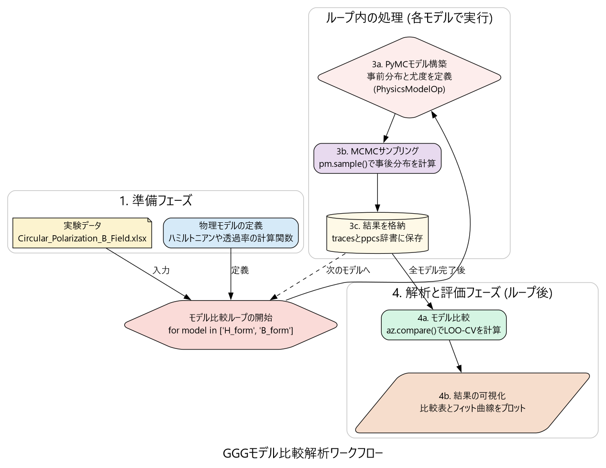

# GGGの磁気光学応答におけるベイズ的モデル比較
## Bayesian Model Comparison for Magneto-Optical Response of GGG

---

## 概要 (Overview)
このリポジトリは、ガドリニウム・ガリウム・ガーネット (GGG) のテラヘルツ帯における透過スペクトルを解析するためのPythonプロジェクトです。物理的なハミルトニアンに基づいた理論モデルと、実験的に得られた透過スペクトルを、ベイズ統計モデリングのフレームワークで統合します。

主な目的は、磁気感受率$\chi(\omega)$のモデルとして、一般的な**H形式**と**B形式**のどちらがより観測データをうまく説明できるかを定量的に評価することです。

## プロジェクトの目的 (Objective)
* **物理モデルの比較**: 磁性体の応答を記述する2つの主要なモデル、$\mu_r = 1 + a \cdot \chi$ (H形式) と $\mu_r = 1 / (1 - a \cdot \chi)$ (B形式) の妥当性を比較する。
* **パラメータの確率的推定**: モデルに含まれる物理パラメータ（感受率のスケーリング係数`a`、緩和定数`gamma`など）を、その不確かさ（確率分布）を含めて推定する。
* **客観的なモデル選択**: 予測性能の指標である**LOO-CV (一個抜き交差検証)** を用い、どちらのモデルがより「良い」モデルであるかを統計的に判断する。

## 解析ワークフロー (Analysis Workflow)
このプロジェクトは、以下のステップで解析を進めます。



1.  **データ準備**: 実験データ (`.xlsx`) をPandasで読み込み、解析に適した形式に前処理します。
2.  **物理モデル定義**: スティーブンス演算子を用いたハミルトニアンから出発し、磁気感受率$\chi(\omega)$、透過率$T(\omega)$を計算する関数をNumPyで実装します。
3.  **ベイズモデル構築**: 物理モデルをPyMCの計算グラフに接続するためのカスタムOp (`PhysicsModelOp`) を定義し、事前分布と尤度を設定します。
4.  **MCMCサンプリング**: NUTSサンプラーを用いて、各モデルのパラメータの事後分布をサンプリングします。
5.  **モデル比較と評価**: ArviZライブラリを用いてLOO-CVスコアを計算し、モデルの優劣を比較するとともに、結果を可視化します。

## セットアップ (Setup)

### 1. Conda環境の構築
この解析は、`conda`による仮想環境での実行を推奨します。
```bash
# conda仮想環境を作成
conda create -n pymc_env python=3.10

# 環境をアクティベート
conda activate pymc_env